### Ошибка 1 — забыта реализация метода добавления книги в коллекцию
Место: mistakes.py, метод mistake_1

Симптом:
Текущее состояние библиотеки всегда одинаково - она пустая.

Как воспроизвести:
Запустить функцию mistake_1() с steps=5, seed=1.

Отладка:
Установлен breakpoint вызов функции run_simulation(5,1).
В отладчике видно, что список на котором реализована коллекция BookCollection всегда пустой даже при добавлении книги:

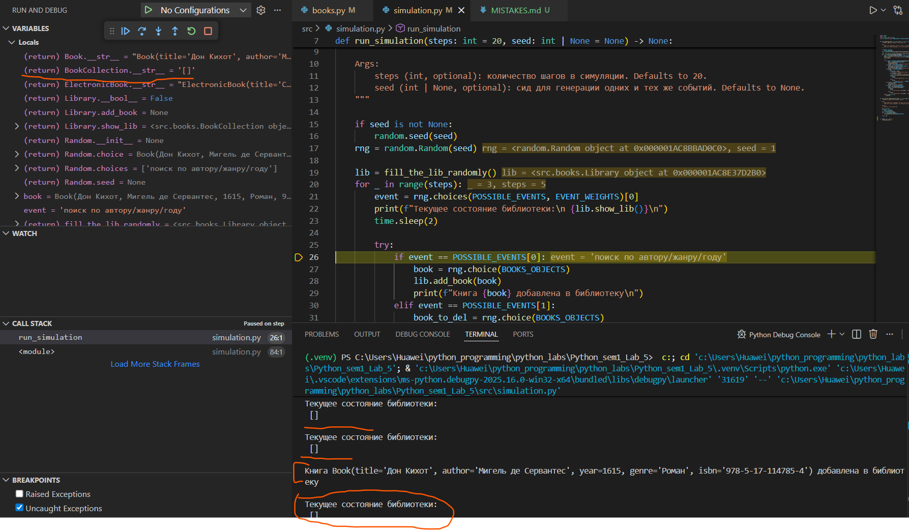

Причина:
Метод добавление книги в коллецию был размечен заглушкой 'pass' и не был реализован:
```
    def add_book(self, book: Book) -> None:
        """метод для добавления книги в коллекцию

        Args:
            book (Book): книга
        """
        pass
```

Исправление:
Добавлена реализация забытого метода add_book - в self._items кладется нужная нам книга

Заменено на:
```
    def add_book(self, book: Book) -> None:
        """метод для добавления книги в коллекцию

        Args:
            book (Book): книга
        """
        self._items.append(book)
```
Проверка:
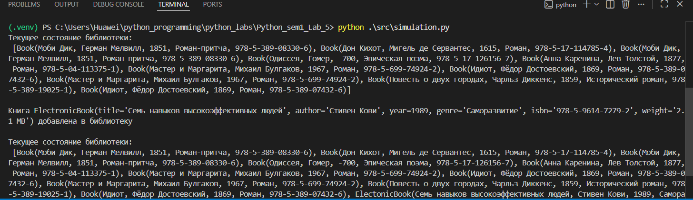
Поведение симуляции соответствует ожидаемому.

---


### Ошибка 2 — нелогичная реализация метода eq для оператора ==
Место: mistakes_clases.py, метод __eq__ в BookCollectionMistake2

Симптом:
При добавлении двух одинаковых по содержанию книг в две коллеции в разном порядке выражение book_collection2 == book_collection1 принимает значени False хотя должно быть True

Как воспроизвести:

Запустить функцию mistake_2 в файле mistakes.py:
```
if __name__=='__main__':
    mistake_2()
```

Отладка:
Установлен breakpoint на print(book_collection2 == book_collection1).
В отладчике видно, что оба списка одинаковы, но элементы в них расположены в разном порядке:
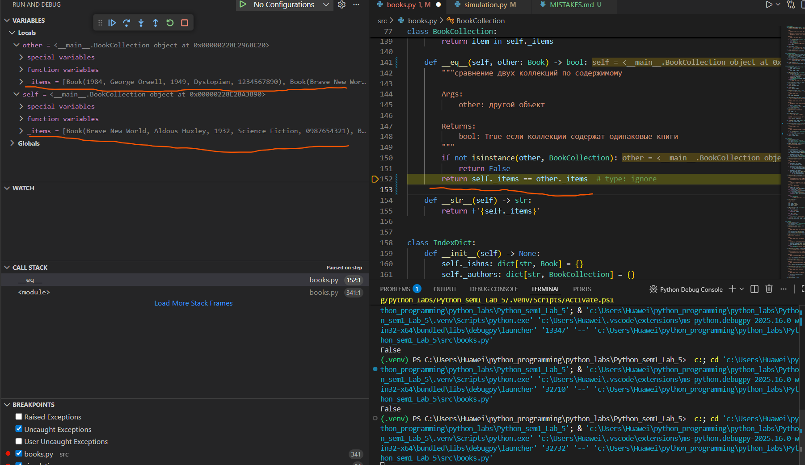

Причина:
Поскольку python сравнивает списки по соответствующим индексам, то такой метод будет работать неверно:
```
    def __eq__(self, other: object) -> bool:
        """сравнение двух коллекций по содержимому

        Args:
            other: другой объект

        Returns:
            bool: True если коллекции содержат одинаковые книги
        """
        return self._items == other._items
```

Исправление:
Теперь коллекция сортируется по isbn, отчего элементы все равно проверяются по индексно, но в нужном нам порядке, ведь по идее две коллекции книг равны когда их логическое пересечение равно обеим коллекциям одновременно (из теории множеств).

Заменено на:
```
    def __eq__(self, other: object) -> bool:
        """сравнение двух коллекций по содержимому

        Args:
            other: другой объект

        Returns:
            bool: True если коллекции содержат одинаковые книги
        """
        if not isinstance(other, BookCollection):
            return False
        if len(self._items) != len(other._items):
            return False
        return (sorted(self._items, key=lambda book: book.isbn)
                == sorted(other._items, key=lambda book: book.isbn))
```

Кроме того добавлен метод __eq__ в в класс Book для явного корректного обьектов:

```
    def __eq__(self, value: object) -> bool:
        if not isinstance(value, Book):
            return False
        return (self.title == value.title and
                self.author == value.author and
                self.year == value.year and
                self.genre == value.genre and
                self.isbn == value.isbn)
```

Проверка:
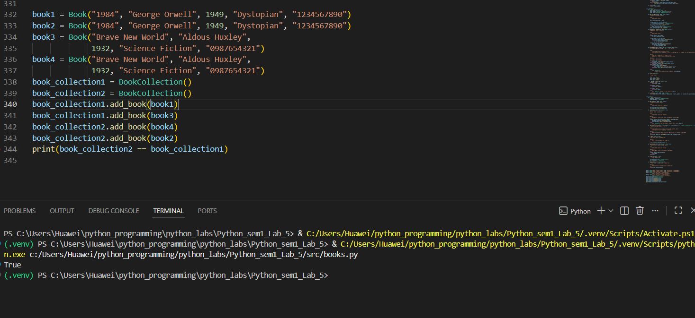
Поведение симуляции соответствует ожидаемому.

---


### Ошибка 3 — неверно реализовано взятие среза от коллекции книг
Место: mistakes_clases.py, метод __getitem__ в BookCollectionMistake3

Симптом:
При попытке взять срез от обьекта класса BookCollection все срабатывает корректно, но к обьекту, возращаемым срезом нельзя применить методы класса, в том числе добавить новую книгу

Как воспроизвести:

Запустить функцию mistake_3 в mistakes.py:
```
if __name__=='__main__':
    mistake_3()
```

Отладка:
Установлен breakpoint вызов на new_coll = book_collection1[:3].
В отладчике видно, переменная new_col ссылается на список, а не на экземпляр класса BookCollection:
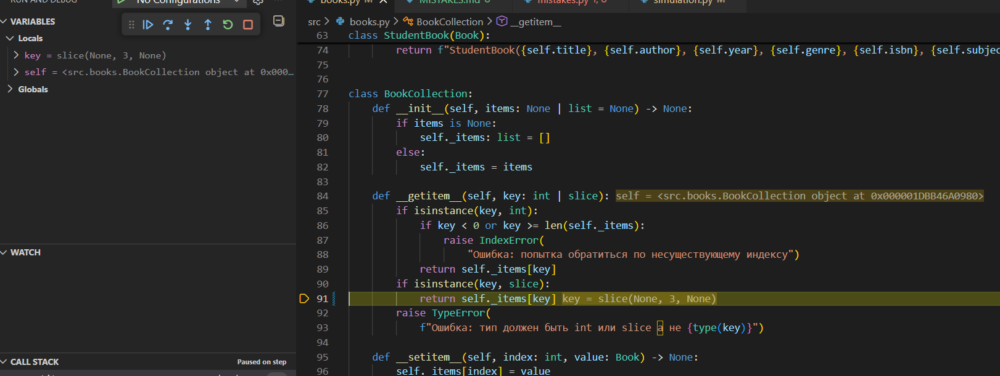
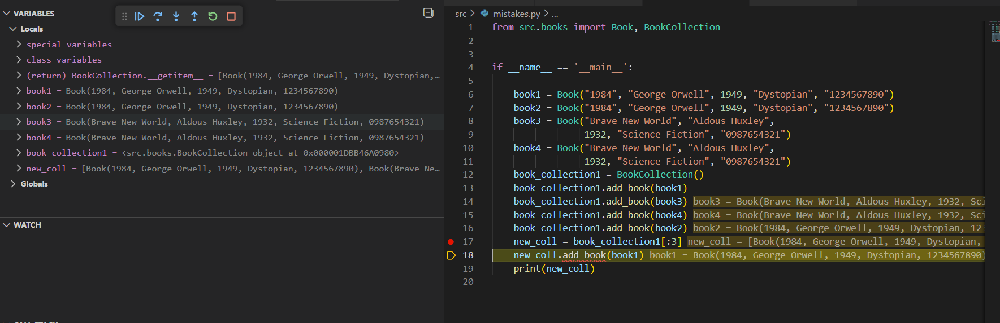

Причина:
Поскольку изначально был реализован следующий метод __getitem__, который не учитывал этот момент, то возникала такая ошибка:
```
    def __getitem__(self, key: int | slice):
        if isinstance(key, int):
            if key < 0 or key >= len(self._items):
                raise IndexError(
                    "Ошибка: попытка обратиться по несуществующему индексу")
            return self._items[key]
        if isinstance(key, slice):
            return self._items[key]
        raise TypeError(
            f"Ошибка: тип должен быть int или slice а не {type(key)}")
```

Исправление:
Теперь при срезе возвращается не сам список, а обьект класса BookCollection, что дает возможность продолжать работу со срезом не как со списком, а как с обьектом класса и вызывать разрешенные методы.

Заменено на:
```
    def __getitem__(self, key: int | slice):
        if isinstance(key, int):
            if key < 0 or key >= len(self._items):
                raise IndexError(
                    "Ошибка: попытка обратиться по несуществующему индексу")
            return self._items[key]
        if isinstance(key, slice):
            return BookCollection(self._items[key])
        raise TypeError(
            f"Ошибка: тип должен быть int или slice а не {type(key)}")
```
Проверка:
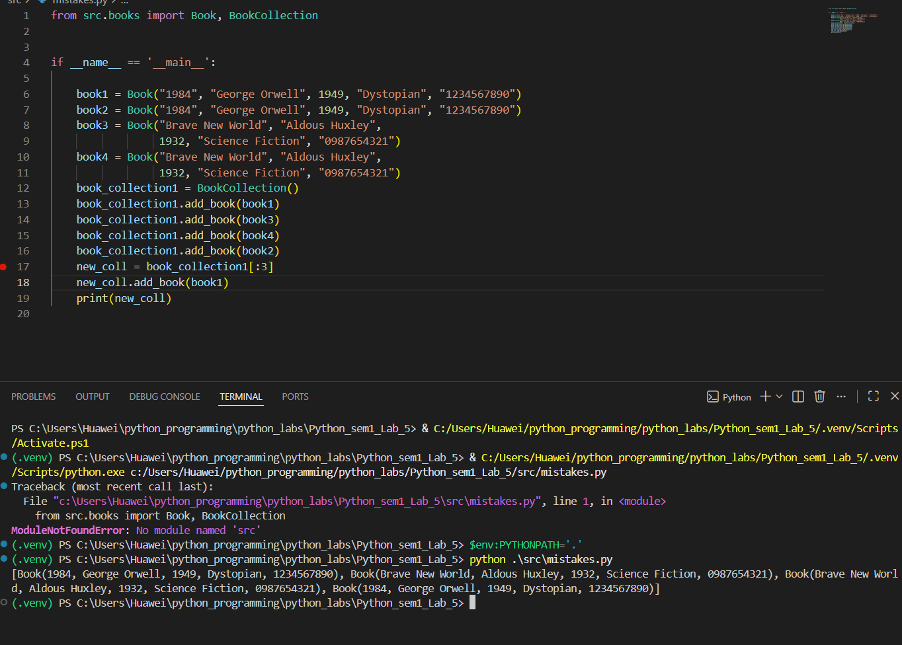
Поведение симуляции соответствует ожидаемому.


### Ошибка 4 — использование изменяемого значения как аргумента по умолчанию
Место: mistakes_clases.py, метод __init__ в BookCollectionMistake4

Симптом:
При создании двух разных обьектов по одному классу и добавлении в первый обьект книги, во втором обьекте тоже отображается добавленная книга

Как воспроизвести:

Запустить функцию mistake_4 в mistakes.py:
```
if __name__=='__main__':
    mistake_4()
```

Отладка:
Установлен breakpoint вызов на book_collection1.add_book(book1).
В отладчике видно, что при добавлении книги в одну из коллекций книга добавляется сразу в обе коллекции. При постановке точки останова на инициализацию обьектов в окне с переменными к сожалению не видно на что ссылается список, отчего нужно заглядывать в реализацию самого класса:
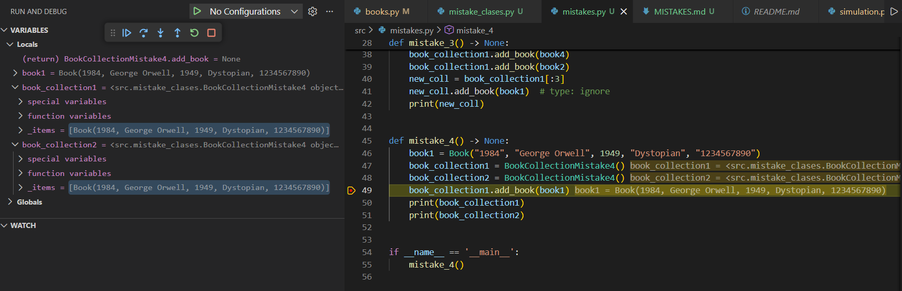

Причина:
Поскольку items ссылается на пустой список, то python под капотом создает его в момент определения класса всего один раз, поэтому для каждого обьекта items будет ссылаться на один и тот же участок памяти, что будет отображаться на всех экземплярах класса:
```
    def __init__(self, items=[]) -> None:
        self._items = items  # type: ignore
```

Исправление:
Теперь список items по умолчанию равен None, поэтому если он None, то уже локально в самом init экземпляра класса создается пустой список.

Заменено на:
```
    def __init__(self, items: None | list = None) -> None:
        if items is None:
            self._items: list = []
        else:
            self._items = items
```
Проверка:
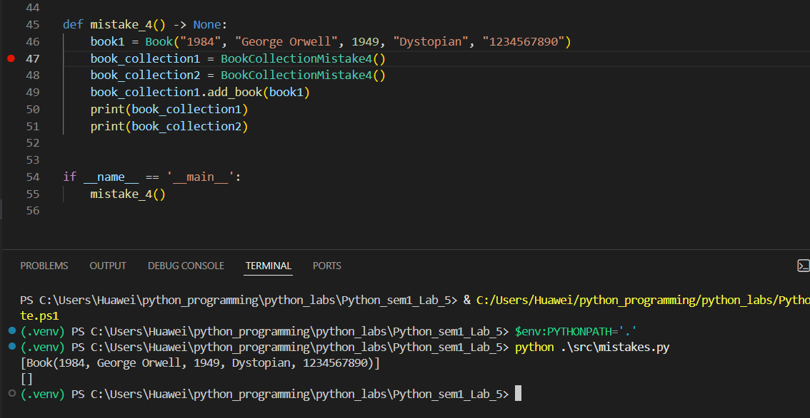
Поведение симуляции соответствует ожидаемому.


### Ошибка 5 — не приведен тип переменной к int
Место: mistakes_clases.py, метод search_book в IndexDictMistake5

Симптом:
При поиске книги по ключу 'год' и существующему значению года выводится None, а не сама книга.

Как воспроизвести:

Запустить функцию mistake_5 в mistakes.py:
```
if __name__=='__main__':
    mistake_5()
```

Отладка:
Установлен breakpoint на print(book_lib.search_by_criteria('year', year)).
В отладчике видно, что при передачи переменной criteria_value в функцию get, criteria_value является строкой, хотя словарь индексирования по году содержит ключи-целые числа:
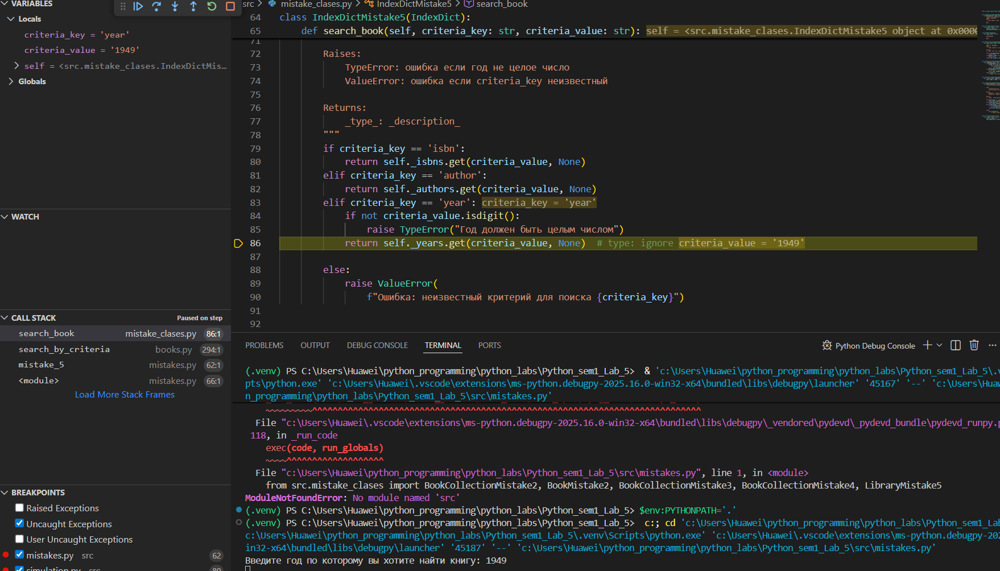

Причина:
Поскольку criteria_value является строкой, а все ключи словаря - целые числа, то такая строка просто не находится как ключ словаря, поэтому возвраащется None, а не желаемая книга:
```
    def search_book(self, criteria_key: str, criteria_value: str)->Book:
        """метод для поиска книги по критерию и его значению

        Args:
            criteria_key (str): критерий поиска
            criteria_value (str): значение критерия поиска (например год выпуска, имя автора или идентификационный номер)

        Raises:
            TypeError: ошибка если год не целое число
            ValueError: ошибка если criteria_key неизвестный

        Returns:
            Book: книжка
        """
        if criteria_key == 'isbn':
            return self._isbns.get(criteria_value, None)
        elif criteria_key == 'author':
            return self._authors.get(criteria_value, None)
        elif criteria_key == 'year':
            if not criteria_value.isdigit():
                raise TypeError("Год должен быть целым числом")
            return self._years.get(criteria_value, None)  # type: ignore

        else:
            raise ValueError(
                f"Ошибка: неизвестный критерий для поиска {criteria_key}")
```

Исправление:
Добавлена функция int к перемнной criteria_value. Теперь поиск происходит корректно

Заменено на:
```
    def search_book(self, criteria_key: str, criteria_value: str) -> None | Book | BookCollection:
        """метод для поиска книги по критерию и его значению

        Args:
            criteria_key (str): критерий поиска
            criteria_value (str): значение критерия поиска (например год выпуска, имя автора или идентификационный номер)

        Raises:
            TypeError: ошибка если год не целое число
            ValueError: ошибка если criteria_key неизвестный

        Returns:
            _type_: _description_
        """
        if criteria_key == 'isbn':
            return self._isbns.get(criteria_value, None)
        elif criteria_key == 'author':
            return self._authors.get(criteria_value, None)
        elif criteria_key == 'year':
            if not criteria_value.isdigit():
                raise TypeError("Год должен быть целым числом")
            return self._years.get(int(criteria_value), None)

        else:
            raise ValueError(
                f"Ошибка: неизвестный критерий для поиска {criteria_key}")
```
Проверка:
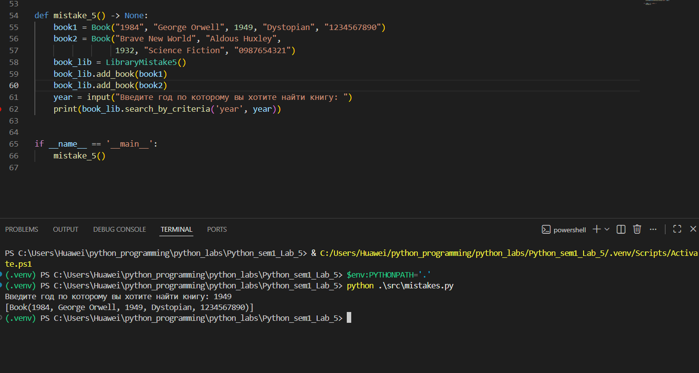
Поведение симуляции соответствует ожидаемому.
